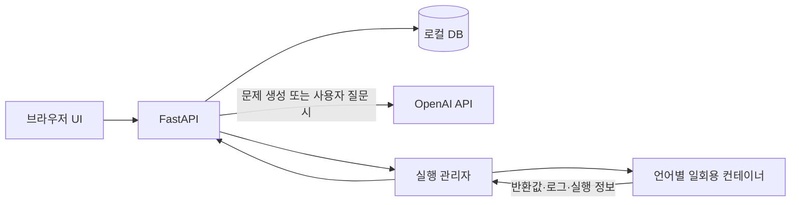

# 로컬 코딩테스트 연습 웹사이트 설계 및 구현 계획

작성일: 2026-09-17

상태: 1차 구현 및 macOS Docker·브라우저 통합 검증 완료. 실제 OpenAI API와 Windows 실기기는 미검증이다. 검증 근거와 실제 팀 배정은 [docs/PROGRESS.md](docs/PROGRESS.md)에 기록한다.

## 1. 목표와 확정된 요구사항

이미지 또는 텍스트로 문제를 등록하면 AI가 문제를 분석하고 테스트케이스를 준비한다. 사용자는 프로그래머스와 유사한 화면에서 코드를 작성하고 로컬에서 실행·제출한다.

- 한국어 UI, 개인용 로컬 웹사이트, 로그인 없이 데스크톱 사용을 우선한다.
- C++·Python·Java·JavaScript를 지원한다. JavaScript는 구현 중 추가된 사용자 요구사항이다.
- 첫 버전은 프로그래머스처럼 함수의 매개변수로 입력을 받고 반환값으로 채점한다. 표준 입출력형 문제는 제외한다.
- 공개 테스트 약 3개와 사용자가 추가·수정·삭제할 수 있는 테스트를 제공한다.
- AI가 히든 테스트도 생성한다.
- 코드 실행은 공개·사용자 테스트를, 제출은 히든을 포함한 전체 테스트를 검사한다.
- 채점은 실제 반환값과 기대 반환값을 비교한다. 코드의 작성 방식이나 알고리즘을 AI가 평가해 정오답을 결정하지 않는다.
- 시간·메모리 측정과 언어별 자원 제한으로 효율성을 확인한다.
- 풀이 도우미는 사용자가 요청할 때만 OpenAI API를 호출한다. 기본은 단계별 힌트이며 명시적인 요청에 전체 풀이·정답 코드를 제공한다.
- macOS와 Windows에서 Docker로 실행한다.
- 문제·테스트·작성 코드·제출 기록을 로컬 DB에 저장한다.
- GitHub에는 소스와 실행 설정을 공유한다. 공개 호스팅은 첫 버전의 대상이 아니다.

## 2. AI를 사용하는 시점

개발용 서브에이전트와 완성된 서비스에서 사용하는 AI API는 별개다. 개발팀의 모델 배정은 [AGENTS.md](AGENTS.md)에 정의한다.

| 동작 | OpenAI API 호출 |
|---|---|
| 등록한 이미지·텍스트 분석 | 사용 |
| 기준 풀이·검증용 풀이·테스트 생성기 작성 및 사용자 요청 재생성 | 사용 |
| 테스트 준비 중 예제 반환 표현 보정 규칙 선택 | 필요한 경우에만 추가 1회 사용 |
| 생성된 기준 풀이 실행, 기대 반환값 계산, 결과 교차 비교 | 사용하지 않음 |
| 사용자 코드 컴파일·실행 | 사용하지 않음 |
| 공개·사용자·히든 테스트 채점 | 사용하지 않음 |
| 실행 시간·메모리 측정 | 사용하지 않음 |
| 코드 자동 저장, 기존 문제 조회 | 사용하지 않음 |
| 사용자가 질문·힌트·정답 요청 | 사용 |

문제와 테스트 준비가 끝나면 AI API 없이 반복해서 실행·제출할 수 있어야 한다. 제출 후 AI 리뷰나 해설 생성을 자동으로 호출하지 않는다.

## 3. 기술 구성과 시스템 경계

| 영역 | 초기 선택 |
|---|---|
| 프런트엔드 | React·TypeScript·Vite |
| 에디터 | Monaco Editor |
| 백엔드 | Python·FastAPI |
| DB | SQLite·SQLAlchemy, Docker 볼륨에 영구 저장 |
| 실행 환경 | 별도 실행 관리자와 언어별 일회용 Docker 컨테이너 |
| 언어 버전 | C++17·Python 3.12·Java 21·JavaScript(Node.js 22) |
| AI 연결 | OpenAI Responses API |
| 로컬 구동 | Docker Compose |

- `web/`: 문제 목록·등록·풀이 화면과 API 클라이언트.
- `server/`: 문제·기록 저장, AI 연결, 테스트 준비, 채점 및 작업 상태 관리.
- `runner/`: 컴파일, 함수 호출 래퍼, 격리 실행, 자원 측정, 실행 환경 구성.
- 웹사이트는 localhost에 노출하고 실행 관리자 API는 외부에 노출하지 않는다.
- Docker 제어 권한은 실행 관리자에만 둔다. 프런트엔드와 사용자 코드에는 Docker 소켓을 전달하지 않는다.
- 사용자 코드와 AI 생성 코드 모두 격리 실행한다. 컨테이너에는 API 키·DB·기대 정답·호스트 소스 디렉터리를 전달하지 않는다.
- 실행 컨테이너는 네트워크 차단, 비루트 사용자, 읽기 전용 기본 파일시스템, 제한된 임시 쓰기 공간, 시간·메모리·프로세스·출력량 제한을 적용한다.
- 기대값 비교는 실행 컨테이너 밖의 백엔드에서 수행한다.

## 4. 화면과 사용자 흐름

### 문제 목록과 등록

1. 문제 목록에서 기존 문제를 열거나 새 문제를 등록한다.
2. 텍스트를 붙여넣거나 이미지를 붙여넣기·업로드한다.
3. AI가 문제 설명, 입출력 예제, 제한사항, 함수의 입력·반환 형식을 분석한다.
4. 사용자가 분석 내용을 확인·수정한다. 원문 예제와 기대값은 별도로 보존한다.
5. 테스트 생성·검증을 실행하고 상태를 표시한다.
6. 준비가 완료된 문제를 풀이 화면에서 연다. 실패한 작업은 오류 이유를 표시하고 기존 입력을 보존한다.

### 풀이 화면

- 왼쪽: 문제 설명 → 제한사항 → 입출력 예 → 입출력 예 설명 순서. 입출력 예는 매개변수 이름과 `result` 열을 갖는 표로 표시하고, 예제 설명은 원문에서 추출하거나 직접 편집한 Markdown을 사용한다.
- 오른쪽: 언어 선택, 해당 언어의 함수 틀, 코드 에디터.
- 아래: 공개·사용자 테스트 편집, 실행 결과, 오류, 디버깅 로그.
- 접을 수 있는 보조 영역: AI 질문·힌트·정답 요청.
- 코드 실행과 제출 버튼을 분리한다.
- 문제별·언어별 작성 코드를 자동 저장하고 제출 이력을 다시 볼 수 있게 한다.
- 히든을 포함한 제출이 한 번이라도 전체 통과하면 문제 목록과 풀이 화면에 ‘풀이 완료’를 표시한다. 준비 상태와 별개인 읽기 전용 `is_solved` 값으로 관리하며 저장된 제출 기록에서 계산한다. 공개 테스트 실행만 성공한 경우에는 완료로 표시하지 않는다. 이후 실패한 제출·새로고침·서버 재시작에도 완료 기록은 유지된다.
- 히든 테스트의 입력·기대값·실제 출력·사용자 로그는 일반 조회 및 제출 결과에 노출하지 않는다. 상태와 실행 정보만 표시한다.

화면의 참고 대상은 [프로그래머스 문제 풀이 페이지](https://school.programmers.co.kr/learn/courses/30/lessons/181832)이며, 로고나 문제 콘텐츠를 저장소에 복제하지 않는다.

## 5. 데이터 및 인터페이스 계약

구현 시작 시 아래 계약을 먼저 구체화하고 고정한다. 프런트엔드 타입은 FastAPI의 OpenAPI 명세를 기준으로 생성한다. 담당자가 독자적인 응답 형식을 추가하지 않는다.

| 개념 | 필요한 정보 |
|---|---|
| Problem | 설명, 제한사항, 원문 예제, 순서가 있는 매개변수와 타입, 반환 타입, 언어별 함수 틀, 준비 상태 |
| TestCase | 입력 인자, 기대 반환값, 공개·사용자·히든 구분, 테스트 버전 |
| ExecutionJob | 문제 및 테스트 버전, 언어, 코드, 실행·제출 구분, 작업 상태 |
| ExecutionResult | 케이스별 판정, 전체 요약, 실행 시간·메모리, 공개 가능한 오류·로그 |
| CodeDraft | 문제, 언어, 작성 코드, 저장 시각 |
| AI 대화 | 문제, 사용자 요청, 응답, 요청 종류, 토큰 사용량 |

- 지원 타입은 정수·문자열·불리언과 이 타입으로 구성된 1·2차원 배열이다. 정수는 32비트와 64비트를 구분한다.
- 64비트 정수는 전송과 JSON 저장 시 십진 문자열로 인코딩하고 타입 정보를 이용해 복원한다. 배열 내부에도 같은 규칙을 적용한다.
- 반환값은 타입과 배열 순서를 포함해 비교한다. 문자열의 공백을 임의로 제거하거나 배열을 자동 정렬하지 않는다.
- C++·Python·JavaScript는 `solution`, Java는 `Solution.solution`을 호출한다. 매개변수와 반환 타입은 문제에 맞는 함수 틀로 제공한다.
- JavaScript는 Node.js 22에서 동기 함수로 실행한다. 64비트 정수는 함수 내부에서 `BigInt`를 사용하고 API 경계에서 십진 문자열로 변환한다.
- 함수 반환값과 표준 출력·표준 오류 로그를 분리한다.
- 출력창은 제목과 로그 본문을 분리하고 실제 줄바꿈을 보존한다. 사용자가 출력한 문자 그대로의 `\n`은 임의로 줄바꿈으로 바꾸지 않는다.
- 판정은 통과, 오답, 컴파일 오류, 실행 오류, 시간 초과, 메모리 초과를 구분한다. 실행 서비스 자체의 장애는 사용자 오답과 구분한다.
- 정답이 여러 개이거나 실수 오차를 허용하는 특수 채점, 사용자 정의 자료형, 대화형 문제는 첫 버전에서 지원하지 않는다. 지원하지 않는 문제를 억지로 일반 채점에 넣지 않는다.
- 테스트 재생성 시 새 버전을 만들고, 제출 기록은 실행 당시의 코드와 테스트 버전에 연결한다.
- API는 문제 등록·수정·목록·조회, 생성 작업 상태, 사용자 테스트 편집, 코드 저장, 실행·제출 및 결과 조회, 제출 이력, AI 질문을 제공한다.
- 히든 데이터와 기준 풀이는 일반 문제 조회 응답에서 제외한다. 클라이언트가 보낸 실행 구분이나 케이스 ID만 믿고 히든 데이터를 반환하지 않는다.

## 6. 테스트 생성과 채점

### 테스트 준비

1. AI가 효율적인 기준 풀이, 작은 입력용 단순 풀이, 입력 생성 및 제약 검증 코드를 작성한다.
2. 두 풀이를 실제 실행해 원문 예제의 기대값과 비교한다.
3. 작은 입력을 다양하게 생성해 두 풀이의 반환값을 교차 비교한다. 가능하면 서로 다른 접근을 사용한다.
4. 생성된 입력이 문제의 제한사항을 만족하는지 확인한다.
5. 검증된 기준 풀이를 실행해 최종 테스트의 기대 반환값을 계산한다.
6. 원문 예제를 우선해 공개 테스트를 약 3개 준비한다. 원문 예제가 더 많으면 버리지 않고 유지한다.
7. 히든은 경계값·특수 조건·무작위·대용량을 포함한 30개를 기본 목표로 한다. 입력 경우의 수가 적으면 가능한 범위로 줄인다.
8. 생성 규칙·난수 시드·실제 케이스·기대값·검증 결과를 저장해 재현할 수 있게 한다.

풀이 결과 불일치, 예제 실패, 실행 실패, 제약 위반 시 문제를 ‘검증 필요’ 상태로 두고 제출 채점을 활성화하지 않는다. 생성된 풀이의 합의만으로 수학적 정확성을 보장한다고 표현하지 않는다. 작은 입력 교차 검증은 큰 입력의 정확성까지 보장하지 않는다.

### 테스트 기대값에 맞춘 AI 풀이의 반환 표현 보정

사용자가 확정한 기대값 표현을 기준으로 AI 풀이의 마지막 반환 부분을 맞춘다. 예를 들어 기대값이 정수 `32231`이고 AI 풀이의 계산 결과가 `[3, 2, 2, 3, 1]`이면, 계산 결과를 이어 붙인 정수로 반환하도록 보정한 뒤 검증한다. 기대값·원본 예제·입력 규격·사용자 코드를 자동 변경하지 않는다.

- 최초 생성 요청부터 입력 규격과 기대값 표현을 두 풀이·입력 생성기·검증기가 함께 따르도록 지시한다.
- 원본 공개 예제의 반환 타입 오류 또는 기대값 불일치가 발생하면, AI에 공통 출력 변환 규칙을 최대 한 번 요청한다. 일반 실행 예외는 보정 대상으로 삼지 않는다. 추가 호출 가능성을 테스트 준비 화면에 표시한다.
- AI는 보정 불가, 정수 나열 이어쓰기, 공백 구분, 쉼표 구분, JSON 배열 문자열 중 하나를 선택한다. 서버는 선택된 규칙으로 두 풀이의 계산 결과만 변환하는 동일한 래퍼를 만들고 Docker에서 실행한다. AI가 기존 알고리즘이나 기대값을 다시 작성하게 하지 않는다.
- 이어쓰기는 단일 정수·64비트 정수·문자열 반환형에, 공백·쉼표·JSON 표기는 문자열 반환형에 적용한다. 순서·부호를 유지하며 불리언·실수·중첩 배열을 정수 나열로 임의 변환하지 않는다. 정수 반환형의 범위 검사를 유지한다. 문자열은 앞자리 0을 보존한다.
- 이미 올바른 반환 타입인 값은 유지한다. 보정 후에도 원본 예제 비교, 작은 입력 50개 교차 검증, 히든 입력 검증을 모두 수행한다. 실제 값 불일치가 남으면 준비 실패이며 기존 테스트는 보존한다.
- 입력 제한 위반, 인프라 장애, 시간·메모리·출력 제한 초과, 작은 입력 교차 검증 실패에는 출력 보정 요청을 하지 않는다.
- 선택한 규칙과 보정 시도 여부를 준비 결과에, 추가 API 사용량을 사용 기록에 남긴다. 저장된 기준 풀이의 기대값 계산과 사용자 실행·제출에는 AI를 호출하지 않는다.
- 이번 변경은 AI 준비 코드의 표현을 맞추는 기능이다. 사용자 반환값의 엄격 비교와 함수형 실행을 유지한다. 초안 우선 저장·표준 입출력형 실행·사용자 출력의 여러 표현 동시 허용은 별도 변경 범위다.

### 사용자 테스트

- 입력과 기대값을 직접 작성할 수 있다.
- 입력만 작성한 뒤 ‘기대 정답 계산’을 요청하면 저장된 기준 풀이를 로컬에서 실행한다. 이 동작에는 API를 호출하지 않는다.
- 직접 작성한 기대값과 기준 풀이 결과가 다르면 차이를 표시한다. 사용자 값을 자동으로 덮어쓰지 않는다.
- 문제의 타입과 제한사항에 맞지 않는 입력은 수정할 수 있도록 오류를 보여준다.

### 실행과 제출

- 실행: 해당 문제의 공개·사용자 테스트만 실행하고 결과와 로그를 보여준다.
- 제출: 공개·사용자·히든 테스트를 검사하고 제출 기록을 저장한다.
- 채점 중 AI 호출은 없다. DB에 저장된 기대값과 실제 반환값을 프로그램으로 비교한다.
- 입력별 실행 시간과 메모리를 측정하고 언어별 제한을 적용한다. 제한은 문제와 함께 관리한다.
- 전체 통과는 이 앱의 테스트 전체를 통과했다는 의미다. 원본 사이트의 공식 채점 결과·점수를 재현한다고 표현하지 않는다.
- 시간복잡도를 실측 시간만으로 확정하지 않는다. macOS와 Windows의 측정값이 동일하다고 가정하지 않는다.

## 7. 웹사이트의 OpenAI API 정책

- 초기 기본 모델은 문제 생성용과 도우미용 모두 `gpt-5-mini`다. 각각 로컬 환경 설정으로 변경할 수 있게 한다.
- 개발팀의 `gpt-5.6-sol`, `gpt-6-astra` 등의 모델 배정을 웹사이트 API 설정에 복사하지 않는다.
- API 키는 서버의 로컬 설정으로만 읽는다. 프런트엔드·로그·GitHub·실행 컨테이너에 노출하지 않는다.
- 문제 분석 및 생성 결과는 Structured Outputs로 형식을 맞춘 뒤 별도 입력 검증과 코드 실행 검증을 수행한다.
- API 응답 거부, 잘린 응답, 잘못된 데이터, 연결 실패를 준비 완료로 취급하지 않는다.
- 생성 실패 시 상위 모델로 자동 전환하거나 무한 재시도하지 않는다. 사용자가 재생성을 요청할 수 있게 한다.
- 풀이 도우미에는 문제, 현재 코드, 필요한 최근 대화만 전송한다. 일반 힌트 요청에는 히든 테스트와 기준 풀이를 포함하지 않는다.
- 원본 이미지를 분석한 뒤 불필요하게 후속 요청마다 다시 보내지 않는다.
- 문제 생성 결과와 테스트를 저장해 재사용한다. 사용 모델과 토큰 사용량을 기록한다.
- 기본 개발 테스트는 API 모의 응답으로 실행한다. 실제 API 연결 검사는 키가 설정된 환경에서 필요한 범위만 수행한다.

## 8. 구현 단계와 인수 조건

아래는 구현 완료 현황이다. 팀 역할과 운영 규칙은 [AGENTS.md](AGENTS.md)를 따른다. AI 연결은 모의 응답과 실제 Docker 생성 검증으로 확인했으며 실제 API 호출은 포함하지 않는다.

### 단계 1: 공통 계약과 프로젝트 기반

- [x] 공통 데이터 계약, API 및 실행기 계약, 오류 구분을 먼저 확정한다.
- [x] 프로젝트 구조, DB 저장, 문제 조회·저장, 작업 상태의 기반을 만든다.
- [x] 문제와 DB가 재시작 후 유지되는지 확인한다.

### 단계 2: AI 없이 실행·채점하는 최소 기능

- [x] 언어별 함수 틀과 실행 래퍼를 구현한다.
- [x] 격리·자원 제한·오류 판정·반환값 비교를 구현한다.
- [x] 직접 만든 예제 문제로 목록→풀이→실행→제출 흐름을 연결한다.
- [x] 코드 저장, 사용자 테스트 편집, 제출 기록을 구현한다.

### 단계 3: 문제 분석과 테스트 생성

- [x] 이미지·텍스트 입력, 분석 결과 확인·수정 화면을 구현한다.
- [x] 기준 풀이·테스트 생성과 실제 실행 검증을 연결한다.
- [x] 실패 상태·사용자 재생성·테스트 버전 보존을 구현한다.

### 단계 4: 요청형 풀이 도우미

- [x] 질문·힌트·명시적인 정답 요청 흐름을 구현한다.
- [x] 입력 중 자동 호출, 실행·제출 시 자동 호출이 없음을 확인한다.
- [x] 대화 맥락, 토큰 사용량, API 실패 처리를 확인한다.

### 단계 5: 통합 검토와 로컬 실행 패키지

- [x] Docker Compose, 로컬 환경변수 예제, macOS·Windows 실행 안내를 작성한다.
- [x] 기능 통합, 컨테이너 종료·정리, 데이터 보존, API 키·히든 데이터 비노출을 검토한다.
- [x] 실제 확인한 플랫폼과 확인하지 못한 플랫폼을 구분해 기록한다.
- [x] 개인 데이터 없이 소스와 실행 설정만 공유 가능한지 확인한다.

### 필수 검증 시나리오

- C++·Python·Java·JavaScript에서 같은 문제의 정답·오답을 일관되게 판정한다.
- 컴파일 오류, 런타임 오류, 무한 루프, 메모리 제한 초과, 과도한 출력을 처리하고 실행을 정리한다.
- 문자열·배열·2차원 배열·64비트 정수의 입력과 반환값이 보존된다.
- 공개·사용자 테스트 추가·수정이 반영되고, 실행과 제출의 검사 범위가 다르다.
- 히든 입력·기대값·실행 로그가 일반 API 응답과 UI에 노출되지 않는다.
- 문제 분석 오류를 수정할 수 있고 검증 실패 문제는 채점 준비 완료가 되지 않는다.
- 문제 등록 이후 AI 연결을 끊어도 저장된 문제를 실행·제출할 수 있다.
- 질문하지 않으면 도우미 API 호출이 없고, 실행·제출·자동 저장에도 AI 호출이 없다.
- API 실패 후 문제 입력과 작성 코드가 유지된다.
- 재시작 후 데이터가 유지되고, 재생성 전 제출 기록의 테스트 버전이 유지된다.
- 실행 코드가 네트워크·API 키·DB·Docker 소켓에 접근하지 못한다.
- macOS와 Windows Docker Desktop의 Linux 컨테이너 환경에서 동일한 기본 흐름을 확인한다. 확보하지 못한 환경은 미검증으로 표시한다.

## 9. 참고 자료

- [OpenAI 서브에이전트](https://learn.chatgpt.com/docs/agent-configuration/subagents)
- [OpenAI Structured Outputs](https://developers.openai.com/api/docs/guides/structured-outputs)
- [GPT-5 Mini 모델](https://developers.openai.com/api/docs/models/gpt-5-mini)
- [Docker 자원 제한](https://docs.docker.com/engine/containers/resource_constraints/)
- [Testlib의 생성기·검증기·정답 검사기 구분](https://github.com/MikeMirzayanov/testlib)

모델 지원 범위와 외부 도구의 사양은 실제 연결 시 공식 문서 및 실행 환경에서 확인한다.
